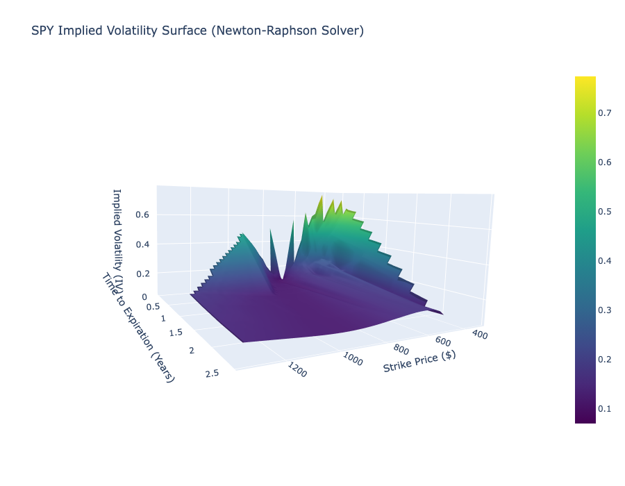

# Real-Time Options Volatility Surface Engine

## 1. Project Overview
This project is a quantitative pricing engine that reverse-engineers the **Implied Volatility (IV)** surface for live options data. By bypassing pre-calculated data feeds, it manually solves for volatility using the **Newton-Raphson method** on the Black-Scholes pricing model.

**Objective:** To visualize the "Volatility Smile" and "Term Structure" of S&P 500 (SPY) options in real-time, demonstrating the non-constant nature of market risk.

## 2. Technical Implementation
* **Data Pipeline:** `yfinance` to fetch live options chains (3,000+ contracts) across all expiration dates.
* **Math Engine:** Custom implementation of the **Black-Scholes-Merton** formula and **Newton-Raphson** numerical optimizer to solve for $\sigma$ (IV).
* **Visualization:** `Plotly` for 3D interactive surface generation (Strike vs. Time vs. IV).
* **Cleaning:** Filters for arbitrage conditions and low-liquidity contracts to ensure surface smoothness.

## 3. Mathematical Basis
The engine solves the inverse problem:
$$C_{market} - C_{model}(\sigma) = 0$$

Where the update step for the root-finding algorithm is:
$$\sigma_{n+1} = \sigma_n - \frac{C(\sigma_n) - C_{market}}{\mathcal{V}(\sigma_n)}$$
($\mathcal{V}$ represents Vega, the derivative of price with respect to volatility).

## 4. Key Features
* **Live Data:** Pulls fresh data on every run; not a static backtest.
* **3D Interactivity:** The Volatility Surface can be rotated to inspect the skew for deep ITM/OTM options.
* **Robust Solver:** Handles edge cases where Vega approaches zero or options are deep in-the-money.

## 5. Visualizations
*(Note: To view the interactive plot, clone the repo and run the notebook locally)*

*Figure 1: 3D Volatility Surface showing the characteristic "Smile" across strike prices and term structure across expiration dates.*

## 6. Tech Stack
* **Python**
* **SciPy** (Optimization/Stats)
* **Pandas** (Data Manipulation)
* **Plotly** (3D Visualization)
* **Nbformat** (Interactive Rendering)
